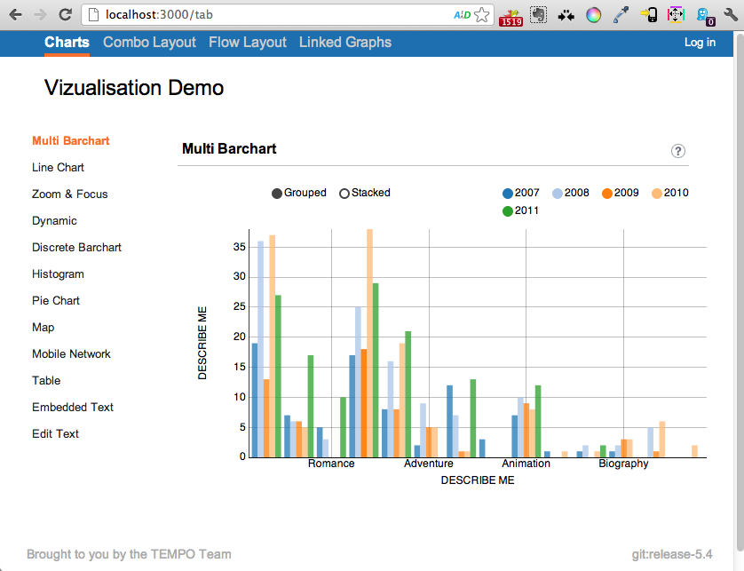

# OMF Web

## Installation

    git clone https://github.com/mytestbed/omf_web.git
    cd omf_web
    bundle
    rake install

## Try the simple example

    git init /tmp/foo
    ruby -I lib -rubygems example/demo/demo_viz_server.rb start
    
This will start a web server at port 3000. Point your browser there and you should see somthing like:

For additional options start the server with -h.

## Design Notes

** These notes are way out of date. Look at the 'demo' example for some guidance **

This module is used to define and run a web server which allows a user to explore and
intereact with various experiments. It is a stand-alone unit communicating through
the OMF messaging framework with other entities.

The content of such a web site consists of

* A +Page+ which is essentially representing a context, most likely that of a
  a single experiment.

* Pages can contain multiple +Cards+. The containing Page will contain
  navigational elements to switch between those cards

* Each card contains one or more +Widgets+ which are arranged by an
  associated +Formatter+ implementing a certain layout.

* A +Session+ represents the context of a specific user of the server. Users
  may be associated with different privileges (not implemented) which determine
  what pages they can see (and interact) and also what cards and widgets

* Theme ... explain

The actual session state is kept in the widgets. The card description (defCard)
defines the formatter to use and the type of widgets to populate it with. The
respective widgets are initialised the first time such a card is rendered
within a user session and kept in the session to be reused the next time
the user requests the card. The primary decision for this design is the fact
that many widgets visualize dynamic state and any updates to that should be
propagated to the user's web browser if that widget instance is visisble there.
Therefore, many widgets either establish web sockets back to the server or
issue periodic AJAX calls. Maintaining interal widget state will also speed
up the rendering of a specific card. The drawback of this design is that it
can create substantial state for each user session. Given the envisioned use
case this is not really a concern as the number of active sessions will be small.
However, we do envision use cases where the server will run for a long time, which
in term will require pruning of 'dead' sessions and the associated freeing of
state.

With such a desing the main extension point will be around widgets and to a lesser
extend around formaters and themes.

As the primary objective of this package is to visualize and interact with dynamic
system state we introduce a few more concepts.

* An +Event+ is a time-stamped tuple (hash) which describes the properties of a
  specific event whch occured at a certain time (timestamp).

* An +EventList+ which holds an (ordered ?) list of Events with every event belonging
  to the same schema. It will be the primary source of information for widgets.

  It provides means for other objects to subscribe to receive notification when the
  list changes. There is also an associated policy on how to maintain the list
  (e.g. keep only the last N recent events). In addition, an event list may subscribe
  to the OMF messaging framework to receive events created by system and other
  experiment services.

